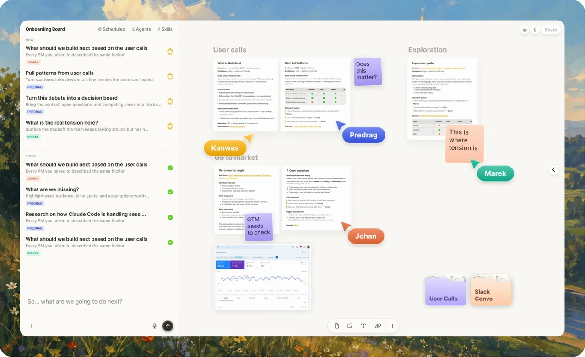

<p align="center">
  
</p>
<p align="center">
  A local-first canvas for the folders and tools you already use.
</p>

# Kanwas

Kanwas is an Electron desktop app that turns a local folder into a visual canvas. Files remain ordinary files on disk, so editors, Git, Claude Code, Codex, and other local tools can work with the same material shown in Kanwas.



## What local-first means

- **Your folder is the source of truth.** Markdown, media, and directories stay in a folder you choose.
- **The desktop app is the product.** There is no hosted application server, account, organization, or cloud workspace requirement.
- **Canvas state stays beside the content.** Kanwas records layout and relationships in `metadata.yaml` files without hiding the underlying documents.
- **External edits are live.** Files changed by an editor or coding agent are reflected back into the canvas.
- **Local agents remain independent.** The embedded terminal and MCP endpoint let your existing CLI agents use Kanwas context without a built-in cloud agent.

## Architecture

Kanwas runs as one Electron application:

```text
Electron main process
  ├─ local-runtime
  │    ├─ folder watcher and persistence
  │    ├─ local REST, terminal WebSocket, and MCP endpoints
  │    └─ yjs-core rooms on the same loopback server
  └─ renderer (React, Vite, React Flow, BlockNote)
          ↕
      selected local folder
```

The loopback server is an internal transport between Electron's renderer and main process. It is private to the app and closes with it.

Yjs keeps the canvas and rich-text editor responsive and transaction-safe while the app is running. The local runtime persists those changes to the selected folder; Yjs is not a cloud database.

See [the system overview](./docs/SYSTEM_OVERVIEW.md) for the data flow and package responsibilities.

## Repository layout

| Package          | Responsibility                                                 |
| ---------------- | -------------------------------------------------------------- |
| `desktop/`       | Electron main process and preload bridge                       |
| `renderer/`      | React/Vite desktop user interface                              |
| `local-runtime/` | Embedded folder, API, terminal, and MCP runtime                |
| `yjs-core/`      | Realtime Yjs room and protocol primitives                      |
| `shared/`        | Shared workspace, filesystem, and API types/utilities          |
| `website/`       | Independent marketing website; not part of the desktop runtime |

## Development

### Prerequisites

- Node.js 22 or newer
- pnpm 10
- macOS or Windows

Install dependencies and start Electron:

```bash
pnpm install
pnpm --filter @kanwas/desktop dev
```

The development task builds the packages needed by Electron. It does not start any separate service.

Run package checks with their workspace scripts:

```bash
pnpm --filter shared test
pnpm --filter @kanwas/yjs-core test
pnpm --filter @kanwas/local-runtime test
pnpm --filter @kanwas/renderer test
pnpm --filter @kanwas/desktop check
```

Create an unpacked production build for the current platform with `pnpm package:desktop:dir`, or create its configured installers with `pnpm package:desktop`. GitHub Actions verifies packaged startup on Linux, macOS, and Windows; version tags publish native installers through GitHub Releases. See [the release guide](./docs/RELEASING.md) for the artifact matrix, versioning, and signing setup.

## Files on disk

Kanwas maps directories to canvases and supported files to nodes. `metadata.yaml` stores spatial information such as positions, edges, groups, and stable IDs. Markdown remains readable and editable without Kanwas.

When both the UI and another program edit the same file, the runtime uses revision checks and merge/conflict handling rather than silently overwriting either side. Atomic writes and watcher suppression prevent Kanwas from treating its own persistence as an external edit.

## Contributing

- Read [the system overview](./docs/SYSTEM_OVERVIEW.md) before changing synchronization or Yjs code.
- Run the checks for every package you modify.
- Keep `website/` independent of desktop runtime packages.
- Open an issue before a large product change so the direction can be discussed first.
- First-time contributors will be asked to sign the [Contributor License Agreement](./.github/CLA.md).

## License

Kanwas is licensed under the [Apache License 2.0](./LICENSE).

## Acknowledgements

Kanwas builds on [Electron](https://www.electronjs.org/), [Yjs](https://github.com/yjs/yjs), [BlockNote](https://www.blocknotejs.org/), React Flow, and the broader open-source ecosystem.
